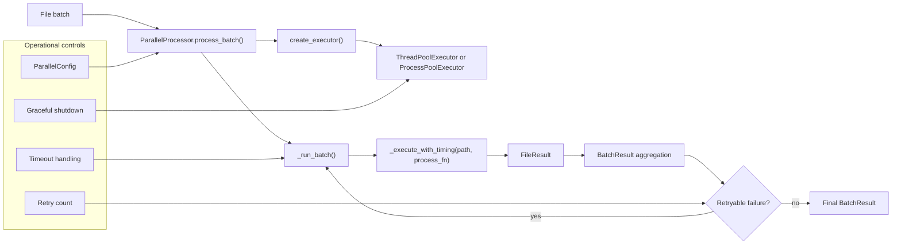
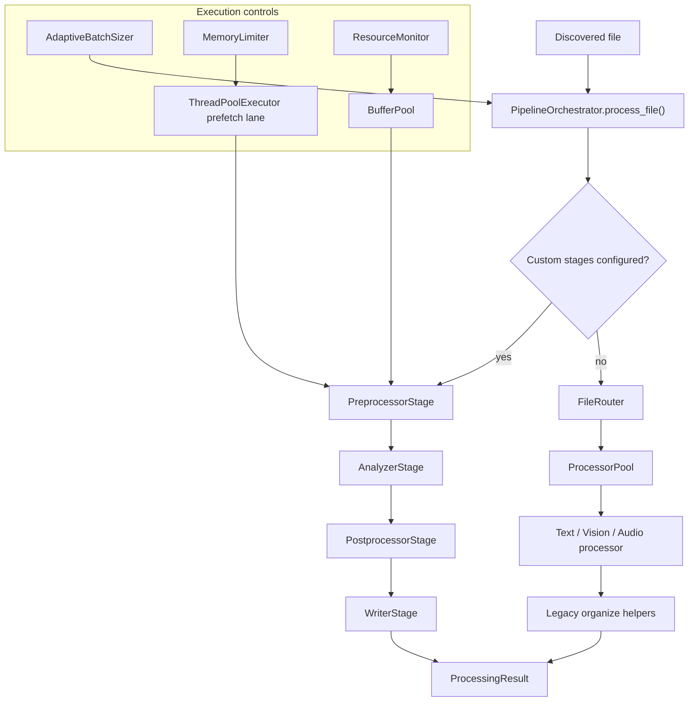
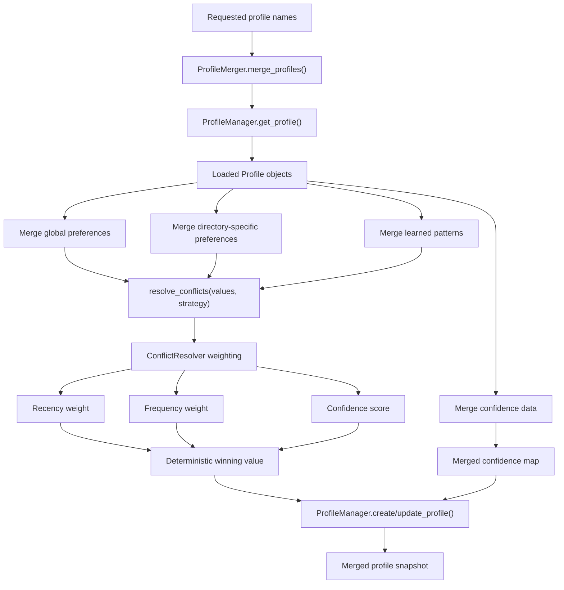

# Module Diagrams

This page captures the current alpha3 runtime flow for the highest-churn subsystems referenced in issue `#1025`.

## Parallel Processing

The parallel layer centers on `ParallelProcessor`, which batches file work onto either thread or process executors, collects completion results, and retries retryable failures.

### Prefetch and task distribution

The executor path is selected from `ParallelConfig.executor_type`; the implementation records which pool type actually ran, then feeds work items through completion-order result collection. Retryable failures loop back into `_run_batch()` with only the failed paths.

## Pipeline Orchestration

`PipelineOrchestrator` supports both the composable stage path and the legacy router-plus-processor path. The stage path is the canonical alpha3 flow.

### Error propagation

Failures stay attached to the file-level `ProcessingResult` so batch callers can continue processing other files while still surfacing the exact stage or processor failure.

## Intelligence Profile Merge and Conflict Resolution

The intelligence layer combines persisted profiles, preference metadata, and deterministic conflict scoring.

### Conflict resolution strategy

`ConflictResolver` normalizes recency, frequency, and confidence weights, computes a combined score for each candidate preference, and uses the most recent candidate as the deterministic tie-breaker when scores match.
